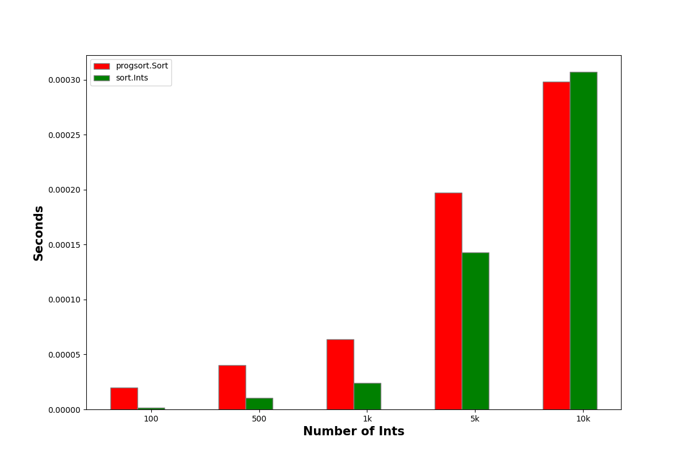
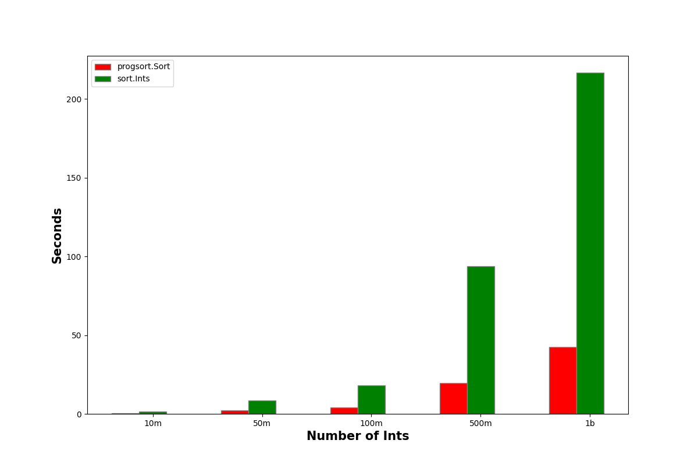

# progsort

[](https://godoc.org/github.com/tidwall/progsort)

Sorts a slice and provides continual progress.

This library was designed specifically to sort very large arrays using multiple
threads while having the ability to monitor the progress while the sort is in-process.

- Stable, uses the [merge sort](https://en.wikipedia.org/wiki/Merge_sort) 
algorithm.
- Multithreaded, splits sorting over multiple goroutines.
- Monitor progress, useful for displaying continual progress for large arrays.
- Cancellable, stop the sort early
- Generics support, Go 1.18+

## Install

Go 1.18+ is required.

```
go get -u github.com/tidwall/progsort
```

## Usage 

```go
// Sort data given the provided less function.
//
// The spare param is a slice that the caller can provide for helping with the
// merge sort algorithm. When this is provided it must the same length as the
// data slice, also the caller is responsible to check the return value to
// determine if the data slice or the spare slice has the final sorted data.
// Setting spare to nil will have the sort operation manage the memory of the
// spare slice under-the-hood by allocating the needed memory, which also
// ensures that the data slice will always end up with the final sorted data.
//
// The prog function can be optionally provided if the caller want to monitor
// the continual progress of the sort operation, which is a percentage between
// the range [0.0,1.0]. Set prog to nil if progress monitoring is not needed.
//
// Return false from the prog function to cancel the sorting early.
func Sort[T any](
	data []T,
	spare []T,
	less func(a, b T) bool,
	prog func(prec float64) bool,
) (swapped bool)
```

## Example 

How to use the `Sort` function using a spare slice.

```go
package main

import (
	"math/rand"

	"github.com/tidwall/progsort"
)

func main() {
	// Create a random list of numbers
	nums := make([]float64, 50_000_000)
	for i := range nums {
		nums[i] = rand.Float64()
	}

	// Create a spare slice that is needed for the merge sort algorithm.
	spare := make([]float64, len(nums))

	// Define the comparator
	less := func(a, b float64) bool {
		return a < b
	}

	swapped := progsort.Sort(nums, spare, less, nil)
	if swapped {
		// The spare slice has the sorted data
	} else {
		// The num slice has the sorted data
	}
}
```

## Example with progress

How to use the `Sort` function using a spare slice and to monitor its progress.

```go
package main

import (
	"fmt"
	"math"
	"math/rand"
	"sync/atomic"
	"time"

	"github.com/tidwall/progsort"
)

func main() {
	// Create a random list of numbers
	nums := make([]float64, 50_000_000)
	for i := range nums {
		nums[i] = rand.Float64()
	}

	// Create a spare slice that is needed for the merge sort algorithm.
	spare := make([]float64, len(nums))

	// Define the comparator
	less := func(a, b float64) bool {
		return a < b
	}

	// Define the prog callback
	prog := func(perc float64) bool {
		fmt.Printf("%0.1f%%\n", perc*100)
		return true
	}

	swapped := progsort.Sort(nums, spare, less, prog)

	if swapped {
		// The spare slice has the sorted data
	} else {
		// The num slice has the sorted data
	}
}
```

## Performance 

The following benchmarks were run on my 2019 Macbook Pro (2.4 GHz 8-Core Intel Core i9) using Go Development version 1.18. The items are simple 8-byte ints.

```
BIGCHART=1 go test -bench . -timeout 60m
```

`progsort.Sort`

```
BenchmarkInts/progsort/100-16        59418         19674 ns/op
BenchmarkInts/progsort/500-16        29150         40506 ns/op
BenchmarkInts/progsort/1000-16       18669         63940 ns/op
BenchmarkInts/progsort/5000-16        5776        197322 ns/op
BenchmarkInts/progsort/10000-16       3722        298280 ns/op
BenchmarkInts/progsort/50000-16       1065       1098492 ns/op
BenchmarkInts/progsort/100000-16       464       2510135 ns/op
BenchmarkInts/progsort/500000-16        85      14014058 ns/op
BenchmarkInts/progsort/1000000-16       51      22202915 ns/op
BenchmarkInts/progsort/5000000-16        7     151768884 ns/op
BenchmarkInts/progsort/10000000-16       4     304130626 ns/op
BenchmarkInts/progsort/50000000-16       1    2277216824 ns/op
BenchmarkInts/progsort/100000000-16      1    3981873534 ns/op
BenchmarkInts/progsort/500000000-16      1   19480695089 ns/op
BenchmarkInts/progsort/1000000000-16     1   42395064737 ns/op
```

`sort.Ints`

```
BenchmarkInts/stdlib/100-16         709266          1453 ns/op
BenchmarkInts/stdlib/500-16         114210         10621 ns/op
BenchmarkInts/stdlib/1000-16         49429         23992 ns/op
BenchmarkInts/stdlib/5000-16          7960        143065 ns/op
BenchmarkInts/stdlib/10000-16         3766        307078 ns/op
BenchmarkInts/stdlib/50000-16          674       1771503 ns/op
BenchmarkInts/stdlib/100000-16         313       3764269 ns/op
BenchmarkInts/stdlib/500000-16          50      21737094 ns/op
BenchmarkInts/stdlib/1000000-16         25      47554151 ns/op
BenchmarkInts/stdlib/5000000-16          2     502221224 ns/op
BenchmarkInts/stdlib/10000000-16         1    1614043333 ns/op
BenchmarkInts/stdlib/50000000-16         1    8444168939 ns/op
BenchmarkInts/stdlib/100000000-16        1   18037104155 ns/op
BenchmarkInts/stdlib/500000000-16        1   93730488701 ns/op
BenchmarkInts/stdlib/1000000000-16       1  216609456504 ns/op
```





